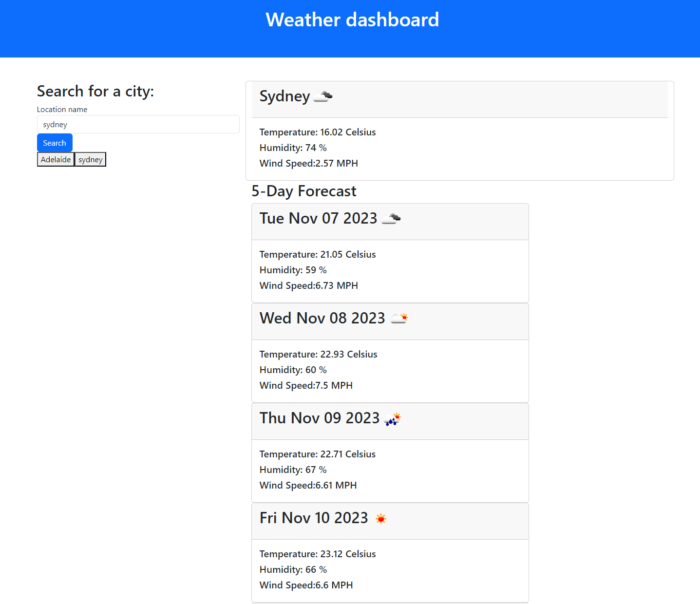

# weather-dashboard
Think it's going to rain? Look down at your phone, not up at the sky! All the weather information you need for where you are now and where you want to be. 

## Description

My motivation for building this app to provide important information to users of weather data so that they could make appropriate plans into the future. 

The problem this weather dashboard solves is that when we don't know the weather predictions we are unable to plan appropriately. Knowing the weather forecast means we are able to adjust what we wear, where we go and how we spend our time outside accordingly.

I have learnt the use of API requests and how to manage the data responses. I have practice dynamically appending information in order for it to be updated easily as requested by the user. During the devleopment of this app, I particularly learnt about how to pass variables from one function to another using the parameters. 

A future direction for this weather dashboard includes recommendations and warnings based on the retrieved data. For example, expanding the retreival to include UV radiation could then prompt an alert to remember to seek shade and apply sunscreen at certain times. 

## Table of Contents

If your README is long, add a table of contents to make it easy for users to find what they need.

- [Usage](#usage)
- [Credits](#credits)

## Usage

To use the weather dashboard, go to this link: https://amylloyd.github.io/weather-dashboard/ 

Type in a location to search for the weather data for that location.

You will then see the current weather information: temperature, humidity and wind speed, as well as a 5-day forecast. If you would like to return to a previously searched location, you can easily access it's button in the search history list. 

## Credits

I received support from a tutor.
I based the search history buttons event listener functionality on a code snippet from: https://typeofnan.dev/how-to-bind-event-listeners-on-dynamically-created-elements-in-javascript/ from https://betterprogramming.pub/dynamically-removing-children-from-a-dom-element-in-javascript-new-node-new-you-6143dabaea89
